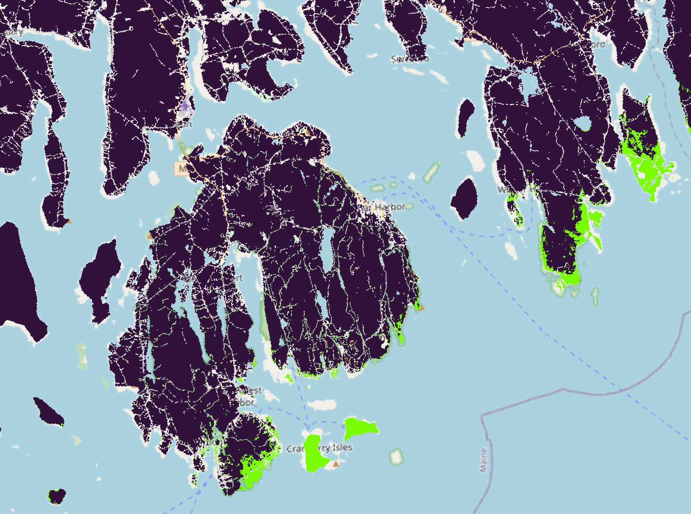

```{r echo = FALSE, include = FALSE}
library(tidyverse)
library(lubridate)
#library(kableExtra)
#library(htmltools)
#library(sf)
#library(gt)
source("index/index_functions.R")

 # <div class = "logo-one">
 #  
 #  </div>

```

<!-- Header -->
<div class = "titlepage-box">
  <div class = "primary-header">
  
  <div class = "headerone">
  CLIMATE CHANGE REFUGIA
  </div>
  <div class = "headertwo">
  ACADIA NATIONAL PARK
  </div>
  
  
  <div class = "titlepage-title">
  Data 
  <div class = "titlepage-title2">
  Summary
  </div>
  <div class = "titlepage-subtitle">
  Current results from the Climate Change Refugia project from data collected by Earthwatch groups like   you.
  </div>
  </div>
  
  </div>
  
  <div class = "image-stack">
  
  
  
  </div>
  
</div>


<div class = "bodybody">
  
  <div class = "intro-box">
  
  
  </div>
  
  
  <div class = "test">
  test
  </div>
  
  
  <div class = "test">
  test
  </div>
  
  
  <div class = "test">
  test
  </div>
  
</div>


