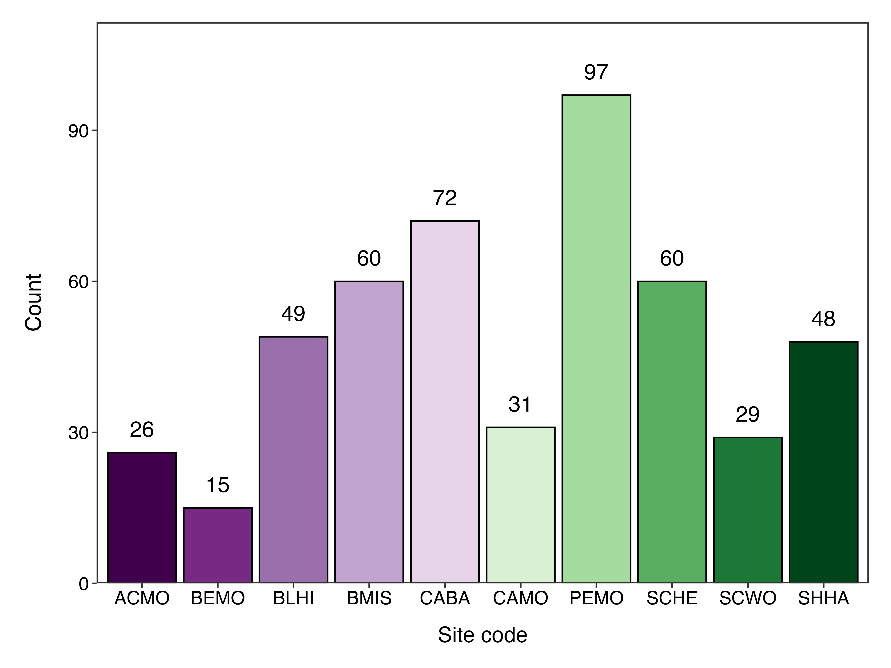

```{r echo = FALSE, include = FALSE}
library(tidyverse)
library(lubridate)
library(ggmap)
library(kableExtra)
library(gt)
#library(htmltools)
#library(sf)


## Read and clean the raw data
cleandat <- tibble(read.csv("index/www/data/refugia_export_20230716.csv")) %>%
  rename_with(., ~tolower(.)) %>%
  select(-c(objectid, creationdate:editor, survey.point.id)) %>% 
  rename(global.id = globalid,
         start.time = survey.start.time,
         group.size = how.many.people.are.in.your.group.,
         crowberry.present = is.black.crowberry.present.,
         num.cells.crowberry = how.many.of.the.grid.cells.contain.crowberry.,
         num.cells.crowberry.flowers = how.many.of.the.grid.cells.contain.crowberry.flowers.,
         num.cells.crowberry.fruits = how.many.of.the.grid.cells.contain.crowberry.fruits.,
         num.cells.crowberry.brleaves = how.many.of.the.grid.cells.contain.brown.crowberry.leaves.,
         cinquefoil.present = is.three.toothed.cinquefoil.present.,
         num.cells.cinquefoil = how.many.of.the.grid.cells.contain.cinquefoil.,
         num.cells.cinquefoil.flowers = how.many.of.the.grid.cells.contain.cinquefoil.flowers.,
         num.cells.cinquefoil.fruits = how.many.of.the.grid.cells.contain.cinquefoil.fruits.,
         num.cells.cinquefoil.brleaves = how.many.of.the.grid.cells.contain.brown.cinquefoil.leaves.,
         end.time = survey.end.time,
         crowberry.inat = did.you.take.a.picture.of.crowberry.and.upload.it.to.inaturalist.,
         cinquefoil.inat = did.you.take.a.picture.of.cinquefoil.and.upload.it.to.inaturalist.,
         notes = notes.,
         longitude = x,
         latitude = y) %>% 
  mutate(survey.date = str_remove(survey.date, "\\s\\d\\:\\d*\\:\\d*\\s\\w*$"),
         survey.date = as.Date(survey.date, format = "%m/%d/%Y"),
         year = as.integer(year(survey.date)),
         group.size = as.numeric(group.size),
         crowberry.present = tolower(crowberry.present),
         cinquefoil.present = tolower(cinquefoil.present),
         site.code = toupper(site.code),
         site.code = str_replace(site.code, "BMSI", "BMIS"),
         site.code = str_replace(site.code, "MDIS", "BMIS"),
         site.code = str_replace(site.code, "CABZ", "CABA"),
         site.code = str_replace(site.code, "CABO", "CABA"),
         grid.cell.number = as.integer(grid.cell.number)) %>% 
  select(site.code, grid.cell.number, latitude, longitude, survey.date, year, 
         start.time, end.time, group.size:notes, global.id) %>% 
  arrange(site.code, survey.date, start.time)


#------------------------------------------------#
####              Summary Stats               ####
#------------------------------------------------#

### Map of sites surveyed
## Get basemap
acad.reg <- get_stamenmap(bbox = c(left = -68.55, bottom = 44.19,
                                  right = -67.93, top = 44.62),
                          zoom = 10)

## Determine which sites have been sampled this year from the cleaned data
sampsites <- cleandat %>%
  filter(year == year(Sys.Date())) %>% 
  distinct(site.code)

## Read in the site location data and add column to specify sampled/unsampled
mapdat <- read.csv("index/www/data/site_locations.csv") %>%
  mutate(site.code = toupper(site.code),
         color = ifelse(site.code %in% sampsites$site.code, "Sampled", "Not sampled"))

## Specify colors and shapes for the map
cols <- c("Not sampled" = "#330033", "Sampled" = "#489619")
shape <- c("Not sampled" = 23, "Sampled" = 21)

## ggmap it
ggmap(acad.reg) +
  geom_point(aes(x = longitude, y = latitude, fill = color, shape = color), size = 3.5,
             data = mapdat, color = "white") +
  theme_bw() +
  scale_fill_manual(values = cols) +
  scale_shape_manual(values = shape) +
  theme(axis.text = element_blank(),
        axis.ticks = element_blank(),
        axis.title = element_blank(),
        plot.background = element_blank(),
        panel.background = element_blank(),
        legend.position = c(0.85, 0.1),
        legend.title = element_blank(),
        legend.text = element_text(size = 12, color = "black"),
        legend.background = element_blank())

## save as PNG for reading in
ggsave("index/www/img/sitemap.png", height = 6, width = 6, dpi = 600)


### Number of grid cells sampled
## Format data
barsum <- cleandat %>% 
  filter(year == 2023) %>% 
  group_by(site.code) %>% 
  summarise(cells = length(unique(grid.cell.number)))

bardat <- read.csv("index/www/data/site_locations.csv") %>% 
  dplyr::select(site.code) %>% 
  mutate(site.code = toupper(site.code),
         cells = 0) %>% 
  left_join(barsum, by = "site.code") %>% 
  tibble() %>% 
  mutate(cells = cells.x + cells.y) %>% 
         #cells = replace(cells, is.na(cells), 0)) %>% 
  dplyr::select(site.code, cells)

## Create ggplot
bardat %>% 
  ggplot(aes(x = site.code, y = cells, fill = site.code)) +
  geom_bar(stat = "identity", color = "black") +
  geom_text(aes(label = cells), vjust = -1, size = 5) +
  labs(x = "Site code", y = "Count") +
  scale_y_continuous(expand = c(0, 0, 0.15, 0)) +
  scale_fill_brewer(palette = "PRGn") +
  theme_bw() +
  theme(panel.border = element_rect(linewidth = 1),
        panel.grid = element_blank(),
        axis.text = element_text(color = "black", size = 12),
        axis.title = element_text(color = "black", size = 14),
        legend.position = "none",
        plot.margin = margin(0.5,0.5,.8,1, unit = "cm"),
        axis.title.x = element_text(vjust = -2),
        axis.title.y = element_text(vjust = 5))

## Save plot as PNG
ggsave("index/www/img/cellbd.png", height = 6, width = 8, dpi = 600)


### Number of cells sampled
celldat <- cleandat %>% 
  filter(year == year(Sys.Date()))

### Average duration of survey
survey.dur <- cleandat %>% 
  filter(year == year(Sys.Date())) %>% 
  mutate(start.time = as.numeric(str_remove(start.time, "\\:")),
         end.time = as.numeric(str_remove(end.time, "\\:")),
         avg.sl = end.time - start.time) %>% 
  dplyr::select(avg.sl) %>% 
  summarise(mean = round(mean(avg.sl), digits = 1))


### Site info table
sitefo <- read.csv("index/www/data/refugia_site_info.csv")


### Number of refugia and non-refugia cells sampled
refcells <- cleandat %>% 
  filter(site.code == "BMIS" | site.code == "CAMO" | site.code == "OTPO" | 
         site.code == "SCHE" | site.code == "SHHA") %>% 
  filter(year == year(Sys.Date()))

nonrefcells <- cleandat %>% 
  filter(site.code == "ACMO" | site.code == "BEMO" | site.code == "CABA" | 
         site.code == "PEMO" | site.code == "SCMO") %>% 
  filter(year == year(Sys.Date()))
  
  
### Number of cells with crowberry
## In refugia site
cbr <- cleandat %>% 
  filter(site.code == "BMIS" | site.code == "CAMO" | site.code == "OTPO" | site.code == "SCHE" | site.code == "SHHA") %>% 
  filter(year == year(Sys.Date())) %>% 
  filter(crowberry.present == "yes")

## in non-refugia site
cbn <- cleandat %>% 
  filter(site.code == "ACMO" | site.code == "BEMO" | site.code == "CABA" | 
         site.code == "PEMO" | site.code == "SCMO") %>% 
  filter(year == year(Sys.Date())) %>% 
  filter(crowberry.present == "yes")


### Number of cells with cinquefoil
## In refugia site
cnr <- cleandat %>% 
  filter(site.code == "BMIS" | site.code == "CAMO" | site.code == "OTPO" | site.code == "SCHE" | site.code == "SHHA") %>% 
  filter(year == year(Sys.Date())) %>% 
  filter(cinquefoil.present == "yes")

## in non-refugia site
cnn <- cleandat %>% 
  filter(site.code == "ACMO" | site.code == "BEMO" | site.code == "CABA" | 
         site.code == "PEMO" | site.code == "SCMO") %>% 
  filter(year == year(Sys.Date())) %>% 
  filter(cinquefoil.present == "yes")


## Map of sites surveyed
## Total grid cells surveyed
## refugia sites with cinq, crow (separate and combined)
## nonrefugia sites with cinq, crow (separate and combined)


```


<!-- Title Page -->
<div class = "titlepage-box">

  <!-- Header -->
  <div class = "primary-header">
  
  <div class = "headerone">
  CLIMATE CHANGE REFUGIA
  </div>
  <div class = "headertwo">
  ACADIA NATIONAL PARK
  </div>
  
  <!-- Title -->
  <div class = "title-box">
  <div class = "titlepage-title">
  Data
  </div>
  <div class = "titlepage-title2">
  <div>Summary</div>
  </div>
  <div class = "titlepage-subtitle">
  Current results from the Climate Change Refugia project made possible by Earthwatch groups like you!
  </div>
  </div>
  
  </div>
  
  <!-- Image stack -->
  <div class = "image-stack">
  
  
  
  </div>
  
</div>


<!-- Body Content -->
<div class = "bodybody">

  <!-- Species box -->
  <div class = "body-box species-box">
  
  <div class = "intro-title">
  Project Background
  </div>
  
  <div class = "photobox">
  <div class = "fotecrow">
  
  </div>    
  <div class = "fotemap">
  
  </div>
  <div class = "fotecinq">
  
  </div>
  </div>
  
  <div class = "descripbox">
  This study monitors black crowberry (<i>Empetrum nigrum</i>) and three-toothed cinquefoil (<i>Sibbaldiopsis tridentata</i>) populations in areas identified as refugia and compares these to populations in non-refugia sites. Refugia are regions that remain relatively buffered from climate change, and allow for the persistence of native species that would otherwise become locally extinct. It is important to determine refugia locations to better monitor our native species over time. These species are also considered arctic disjunct; plants that typically grow further north in cooler arctic tundra or alpine environments, but have some separate populations further south. The Acadia National Park region has the potential to support these species under future climate conditions because of the narrower temperature range due to the elevation and proximity to the ocean and has been protected from development.
  </div>
  
  </div>
  
  
  
  <!-- Intro summary box -->
  <div class = "body-box intro-box">
  
  <div class = "intro-title">
  `r year(Sys.Date())` Progress Overview
  </div>
  
  <div class = "sitemap">
  
  </div>
        
  <div class = "intro-textbox">
  <div class = "num-sites"> 
  <svg xmlns="http://www.w3.org/2000/svg" height="1.5em" viewBox="0 0 576 512"><!--! Font Awesome Free 6.4.0 by @fontawesome - https://fontawesome.com License - https://fontawesome.com/license (Commercial License) Copyright 2023 Fonticons, Inc. --><path d="M408 120c0 54.6-73.1 151.9-105.2 192c-7.7 9.6-22 9.6-29.6 0C241.1 271.9 168 174.6 168 120C168 53.7 221.7 0 288 0s120 53.7 120 120zm8 80.4c3.5-6.9 6.7-13.8 9.6-20.6c.5-1.2 1-2.5 1.5-3.7l116-46.4C558.9 123.4 576 135 576 152V422.8c0 9.8-6 18.6-15.1 22.3L416 503V200.4zM137.6 138.3c2.4 14.1 7.2 28.3 12.8 41.5c2.9 6.8 6.1 13.7 9.6 20.6V451.8L32.9 502.7C17.1 509 0 497.4 0 480.4V209.6c0-9.8 6-18.6 15.1-22.3l122.6-49zM327.8 332c13.9-17.4 35.7-45.7 56.2-77V504.3L192 449.4V255c20.5 31.3 42.3 59.6 56.2 77c20.5 25.6 59.1 25.6 79.6 0zM288 152a40 40 0 1 0 0-80 40 40 0 1 0 0 80z"/></svg>
  <div class = "highlight-text"> `r (length(sampsites$site.code)/10)*100`% </div>
  of sites sampled
  </div>
  <div class = "study-year"> 
  <svg xmlns="http://www.w3.org/2000/svg" height="1.5em" viewBox="0 0 448 512"><!--! Font Awesome Free 6.4.0 by @fontawesome - https://fontawesome.com License - https://fontawesome.com/license (Commercial License) Copyright 2023 Fonticons, Inc. --><path d="M152 24c0-13.3-10.7-24-24-24s-24 10.7-24 24V64H64C28.7 64 0 92.7 0 128v16 48V448c0 35.3 28.7 64 64 64H384c35.3 0 64-28.7 64-64V192 144 128c0-35.3-28.7-64-64-64H344V24c0-13.3-10.7-24-24-24s-24 10.7-24 24V64H152V24zM48 192h80v56H48V192zm0 104h80v64H48V296zm128 0h96v64H176V296zm144 0h80v64H320V296zm80-48H320V192h80v56zm0 160v40c0 8.8-7.2 16-16 16H320V408h80zm-128 0v56H176V408h96zm-144 0v56H64c-8.8 0-16-7.2-16-16V408h80zM272 248H176V192h96v56z"/></svg>
  <div class = "highlight-text"> `r ifelse(year(Sys.Date())-2022 == 1, paste("1st"), ifelse(year(Sys.Date())-2022 == 2, paste("2nd"), ifelse(year(Sys.Date())-2022 == 3, paste("3rd"), paste0(year(Sys.Date())-2022, "th"))))` </div>
  year of the project
  </div>
  <div class = "num-cells"> 
  <svg xmlns="http://www.w3.org/2000/svg" height="1.5em" viewBox="0 0 512 512"><!--! Font Awesome Free 6.4.0 by @fontawesome - https://fontawesome.com License - https://fontawesome.com/license (Commercial License) Copyright 2023 Fonticons, Inc. --><path d="M448 96V224H288V96H448zm0 192V416H288V288H448zM224 224H64V96H224V224zM64 288H224V416H64V288zM64 32C28.7 32 0 60.7 0 96V416c0 35.3 28.7 64 64 64H448c35.3 0 64-28.7 64-64V96c0-35.3-28.7-64-64-64H64z"/></svg>
  <div class = "highlight-text"> `r n_distinct(celldat$grid.cell.number)` </div>
  total cells surveyed
  </div>
  <div class = "survey-duration"> 
  <svg xmlns="http://www.w3.org/2000/svg" height="1.5em" viewBox="0 0 448 512"><!--! Font Awesome Free 6.4.0 by @fontawesome - https://fontawesome.com License - https://fontawesome.com/license (Commercial License) Copyright 2023 Fonticons, Inc. --><style>svg{fill:#ffffff}</style><path d="M176 0c-17.7 0-32 14.3-32 32s14.3 32 32 32h16V98.4C92.3 113.8 16 200 16 304c0 114.9 93.1 208 208 208s208-93.1 208-208c0-41.8-12.3-80.7-33.5-113.2l24.1-24.1c12.5-12.5 12.5-32.8 0-45.3s-32.8-12.5-45.3 0L355.7 143c-28.1-23-62.2-38.8-99.7-44.6V64h16c17.7 0 32-14.3 32-32s-14.3-32-32-32H224 176zm72 192V320c0 13.3-10.7 24-24 24s-24-10.7-24-24V192c0-13.3 10.7-24 24-24s24 10.7 24 24z"/></svg>
  <div class = "highlight-text"> `r paste(survey.dur)` min </div>
  average survey duration
  </div>
  </div>
  
  <div class = "barbox">
  <div class = "bartitle">
  Cells surveyed by site
  </div>
  <div class = "bartable">
  `r kbl(sitefo, col.names = c("Site name", "Site code", "Refugia?")) %>% kable_styling(bootstrap_options = "hover")`
  </div>
  <div class = "barplot">
  
  </div>
  </div>
  
  </div>
  
  
  
  <!-- Species box -->
  <div class = "body-box species-box">
  
  <div class = "intro-title">
  Species Breakdown
  </div>
  
  <div class = "species-stats">
  
  <div class = "species-title">
  What percentage of cells contain the target species?
  </div>
  
  <div class = "crowbox">
  <div class = "crowtitle">
  Black crowberry <br> (<i class = "spep">Empetrum nigrum</i>)
  </div>
  
  <div class = "crow-text">
  <div class = "arrowleft">
  <svg xmlns="http://www.w3.org/2000/svg" height="120px" viewBox="0 0 384 512" class = rotatepos><!--! Font Awesome Free 6.4.0 by @fontawesome - https://fontawesome.com License - https://fontawesome.com/license (Commercial License) Copyright 2023 Fonticons, Inc. --><path d="M214.6 9.4c-12.5-12.5-32.8-12.5-45.3 0l-128 128c-12.5 12.5-12.5 32.8 0 45.3s32.8 12.5 45.3 0L160 109.3V480c0 17.7 14.3 32 32 32s32-14.3 32-32V109.3l73.4 73.4c12.5 12.5 32.8 12.5 45.3 0s12.5-32.8 0-45.3l-128-128z"/></svg>
  </div> 
  <div class = "arrowright">
  <svg xmlns="http://www.w3.org/2000/svg" height="120px" viewBox="0 0 384 512" class = rotateneg><!--! Font Awesome Free 6.4.0 by @fontawesome - https://fontawesome.com License - https://fontawesome.com/license (Commercial License) Copyright 2023 Fonticons, Inc. --><path d="M214.6 9.4c-12.5-12.5-32.8-12.5-45.3 0l-128 128c-12.5 12.5-12.5 32.8 0 45.3s32.8 12.5 45.3 0L160 109.3V480c0 17.7 14.3 32 32 32s32-14.3 32-32V109.3l73.4 73.4c12.5 12.5 32.8 12.5 45.3 0s12.5-32.8 0-45.3l-128-128z"/></svg>
  </div> 
  
  <div class = "ref-text">
  Refugia
  <div class = "ref-perc">
  `r round(length(cbr$crowberry.present)/n_distinct(refcells$grid.cell.number)*100, digits = 0)`%
  </div>
  </div>
  <div class = "nonref-text">
  Non-refugia
  <div class = "ref-perc">
  `r round(length(cbn$crowberry.present)/n_distinct(refcells$grid.cell.number)*100, digits = 0)`%
  </div>
  </div>
  </div> 
  
  </div>  
  
  <div class = "cinqbox">
  <div class = "cinqtitle">
  Three-toothed cinquefoil <br> (<i class = "spep">Sibbaldiopsis tridentata</i>)
  </div>
  
  <div class = "cinq-text">
  <div class = "arrowleft">
  <svg xmlns="http://www.w3.org/2000/svg" height="120px" viewBox="0 0 384 512" class = rotatepos><!--! Font Awesome Free 6.4.0 by @fontawesome - https://fontawesome.com License - https://fontawesome.com/license (Commercial License) Copyright 2023 Fonticons, Inc. --><path d="M214.6 9.4c-12.5-12.5-32.8-12.5-45.3 0l-128 128c-12.5 12.5-12.5 32.8 0 45.3s32.8 12.5 45.3 0L160 109.3V480c0 17.7 14.3 32 32 32s32-14.3 32-32V109.3l73.4 73.4c12.5 12.5 32.8 12.5 45.3 0s12.5-32.8 0-45.3l-128-128z"/></svg>
  </div> 
  <div class = "arrowright">
  <svg xmlns="http://www.w3.org/2000/svg" height="120px" viewBox="0 0 384 512" class = rotateneg><!--! Font Awesome Free 6.4.0 by @fontawesome - https://fontawesome.com License - https://fontawesome.com/license (Commercial License) Copyright 2023 Fonticons, Inc. --><path d="M214.6 9.4c-12.5-12.5-32.8-12.5-45.3 0l-128 128c-12.5 12.5-12.5 32.8 0 45.3s32.8 12.5 45.3 0L160 109.3V480c0 17.7 14.3 32 32 32s32-14.3 32-32V109.3l73.4 73.4c12.5 12.5 32.8 12.5 45.3 0s12.5-32.8 0-45.3l-128-128z"/></svg>
  </div> 
  
  <div class = "ref-text">
  Refugia
  <div class = "ref-perc">
  `r round(length(cnr$cinquefoil.present)/n_distinct(refcells$grid.cell.number)*100, digits = 0)`%
  </div>
  </div>
  <div class = "nonref-text">
  Non-refugia
  <div class = "ref-perc">
  `r round(length(cnn$cinquefoil.present)/n_distinct(refcells$grid.cell.number)*100, digits = 0)`%
  </div>
  </div>
  </div> 
  
  </div>
  
  </div>
  
  </div>
  
  <!-- Trends box - coming 2024 -->
  
</div>


